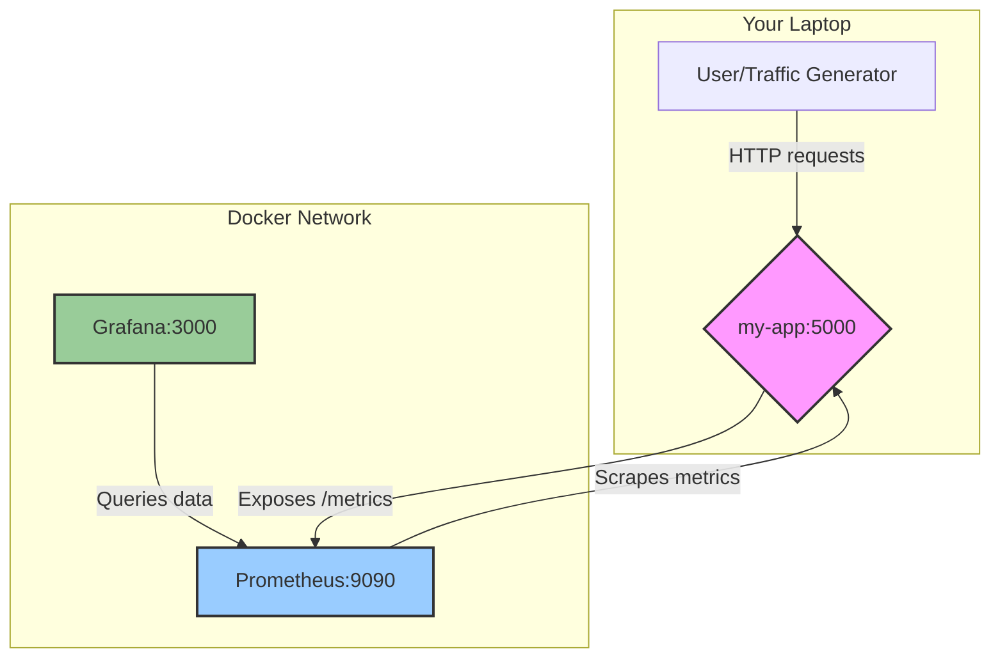

# Local Cloud Ops Sandbox: IaC and Monitoring Demo

This project is a fully-containerized, local sandbox environment designed to demonstrate core Cloud Ops and DevOps principles, including Infrastructure as Code (IaC) and Observability.

It provisions a complete monitoring stack (Prometheus & Grafana) to observe a simple Python web application, all defined and managed through code. It's a perfect miniature of how a modern cloud-native application environment is managed.

## Architecture

The entire environment is orchestrated by Docker Compose, creating an internal network where services can communicate.

# Core Concepts Demonstrated
Infrastructure as Code (IaC): The docker-compose.yml file acts as our IaC, defining every service, network, and volume in a single, version-controlled file. This is analogous to using Terraform or AWS CloudFormation.
Observability & Monitoring:
Instrumentation: The Python app is instrumented to expose key metrics (e.g., request counts).
Collection: Prometheus acts as our monitoring backend, scraping and storing these metrics (like AWS CloudWatch Metrics).
Visualization: Grafana provides a dashboard to visualize the application's health in real-time (like AWS CloudWatch Dashboards).
Automated Provisioning: Grafana's data source and dashboard are provisioned automatically from configuration files, eliminating manual setup and ensuring a repeatable environment.
Containerization: Each component runs in its own isolated Docker container, demonstrating a microservices-based approach.
Prerequisites
Docker
Docker Compose (Included with Docker Desktop)

# How to Run
1. Clone the repo
* git clone https://github.com/subash2021/cloud-ops-sandbox.git
* cd ops-interview-prep

2. Build and start all services
* docker-compose up -d --build
* go to - http://localhost:3000/dashboards and find the single dashboard and click on it

3. Generate traffic, run bash
* while true; do curl http://localhost:5000; echo " - Request sent at $(date)"; sleep 2; done
* allow 5 mins and go back to the Grafana dashboard URL and observe the data 

4. To Stop
* docker-compose down
